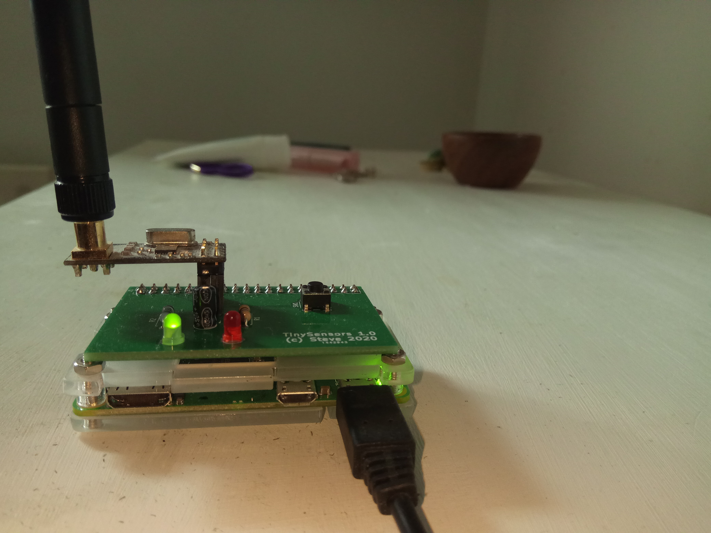

View this project on [CADLAB.io](https://cadlab.io/project/23203). 

# DevBoards
Development and breakout boards for use in Arduino projects, with Gerbers.

## t84opti
An ATtiny84 development board with FTDI interface. Works very well
with [Optiboot](https://github.com/Optiboot/optiboot),
in particular with the [ATTinyCore](https://github.com/SpenceKonde/ATTinyCore). (Top, in picture.)

## t85opti
Same as t84opti, except with ATtiny85, and no LED_BUILTIN. (Bottom, in picture.)

## nrf24l01
A breadboard adapter for the
[nrf24l01](https://howtomechatronics.com/tutorials/arduino/arduino-wireless-communication-nrf24l01-tutorial/)
short-range wireless module. (Right, in picture.)

## ncp1402
A breadboard adapter for the [ncp1402](https://www.onsemi.com/pub/Collateral/NCP1402-D.PDF)
step-up switching regulator ("boost converter"). (Left, in picture.) <i>Warning: SMD soldering required!</i>

## nrf24l01-rpi
A Raspberry Pi "hat" containing an SPI-connected nrf24l01+ radio, two status
LEDs and a shutdown button.

## d1-nrf24l01-shield
A shield for the popular Wemos D1 Mini ESP8266 board containing an SPI-connected nrf24l01+ radio.
